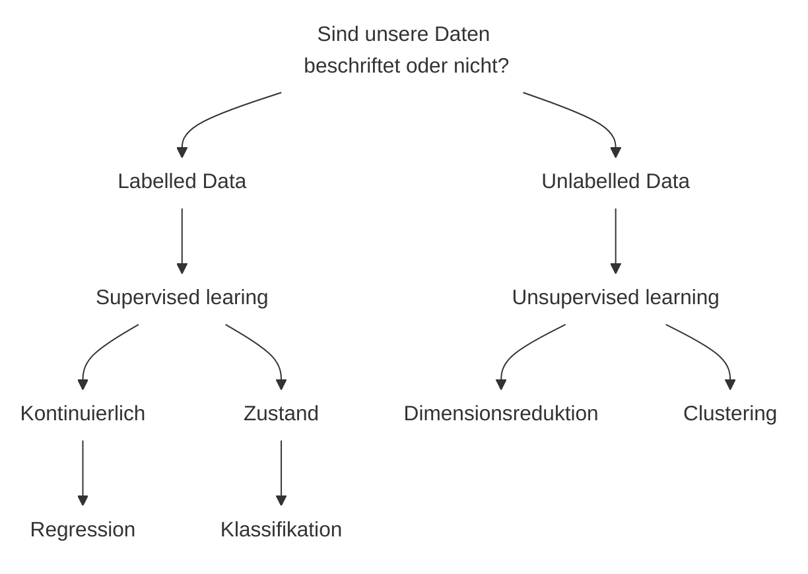

## Data Mining - Klassifikation
### Zweck der Modelierung
- ausgehend von einer oder mehreren Variablen auf eine weitere Variable zu schließen bzw. diese vorherzusagen
- die Anwendung von Algorithmen, die aus einer gegebenen Menge von Fakten $F$ ein Muster $E_F$ generieren.
### Was sind abhängige und unabhängige Variablen?
- Die Variable, auf die geschlossen werden soll, wird als abhängige Variable (Kriterium / Response/ Output/ Y) bezeichnet. 
- Die Variablen, welche zur Vorhersage herangezogen werden, heißen unabhängige Variablen (Prädiktoren/ Faktor / Feature / X)
### Wann verwendet man Modelierung?
2 Ziele 
- Messung des Einflusses einer oder mehrerer Variablen auf eine weitere Variable 
	- Was hat einen Einfluss auf die Konzentrationsfähigkeit von Kindern? 
	- Haben das Bildungsniveau der Eltern und der Wohnort einen Einfluss auf das zukünftige Bildungsniveau von Kindern? 
- Vorhersage einer Variable durch eine oder mehrere andere Variablen 
	- Wie lange bleibt ein Patient im Krankenhaus? 
	- Welches Produkt kauft eine Person am ehesten in einem Online-Shop? 
Die Modelierung gibt Aufschluss darüber, wie sich der Wert der abhängigen Variable ändert, wenn eine der unabhängigen Variablen geändert wird
### Mehrere Begriffe – gleiche Bedeutung
Data mining (= Mustererkennung, Statistik: Modellierung) ist die Anwendung von Algorithmen, die aus einer gegebenen Menge von Fakten F unter bestimmten Ressourcenbeschränkungen ein Muster E(f) generieren.
### Daten und Muster in Daten
- Daten: eine Menge F von Fakten (Fälle, Beispiele, Beobachtungen):
	- Einkaufstransaktionen 
	- Sätze in einer Datei 
- Muster (generiertes Wissen): ein Ausdruck (eng: Expression) E einer Sprache L zur Beschreibung einer Teilmenge FE von F. Dabei ist E einfacher (zu lesen, zu interpretieren, zu speichern usw.) als die Aufzählung der gesamten Faktenmenge FE, zum Beispiel: 
	- Beschränkung der Werte für Kreditkartennummern 
	- Beziehung zwischen letzter und nächster Einkaufstransaktion 
	- Regeln
### Data Mining (=Mustererkennung) im Überblick
1. Daten Sammeln
	- Interne Quellen (firmeneigene Datenbanken) 
	- Externe Quellen (Drittanbieter, öffentliche Datenbanken, Social Media)
2. Feature Engineering
	- bereitet die Rohdaten in einem maschinenlesbaren Format auf 
		a) Feature transformation
		- Daten (Binning) oder umgekehrt (One-Hot-Encoding) um. 
		- Binning: Alter in Jahren --> Altersgruppen, z. B. 18-25, 25-30 
		- One-Hot-Encoding: die Kategorien „Spam“ und „kein Spam“ werden in 1 und 0 umgewandelt
		b) Feature extraction and selection
		- Kombination mehrerer Variablen zu einer neuen Variablen Auswahl einer Teilmenge der relevantesten Merkmale zur Darstellung eines Modells ! sonst das Problem „Alles ist wichtig“ --> nicht informativ für die Entscheidung
		c) Feature scaling
		- transformiert die Daten hinsichtlich Bereich und Verteilung. Der ursprüngliche Datentyp bleibt erhalten.
		- Min-max scaling $\tilde{x} = \frac{x - \min(x)}{\max(x) - \min(x)}$
		- Z-score scaling $\tilde{x} = \frac{x - mean(x)}{sqr(var(x))}$
3. Modell Trainieren
	- die Anwendung von Algorithmen, die aus einer gegebenen Menge von Fakten $F$ ein Muster $E_{F}$ generieren

### Datenkennzeichnung (Data Labeling)
- Hinzufügen von Tags oder Kennzeichnungen zu Rohdaten 
	- wie Zahlen, Bildern, Videos, Text und Audio
- stellen dar, zu welcher Objektklasse die Daten gehören
- helfen Modell, diese bestimmte Objektklasse zu identifizieren, wenn  ohne Tag angetroffen
### Regressionsalgorithmen
- schätzen kontinuierliche numerische Werte
- Anwendung in der Praxis
	- z.B. Schätzung von Immobilienpreisen in einem Viertel, Börsenpreisentwicklung, Einkommen
### Klassifikationsalgorithmen
- liefern Output in vordefinierten Kategorien.
- Anwendung in der Praxis 
	- Vorhersage der Kundenabwanderung 
		- Was: Einschätzung, ob ein Kunde die Geschäftsbeziehung beenden wird 
		- Wo: Dienstleistungsbranche, insbesondere Vertragsgeschäft 
	- Direktwerbung 
		- Was: Vorhersage, ob ein Kunde auf eine gezielte Ansprache reagieren wird 
		- Wo: Versandhandel, Dienstleistungsbranche, praktisch jede Branche 
	- Fehlerprognose/Qualitätsmanagement 
		- Was: Überprüfung, ob ein Produkt fehleranfällig ist 
		- Wo: Produktionsindustrie, Softwareindustrie
- Kreditwürdigkeitsprüfung 
	- Was: Vorhersage der Wahrscheinlichkeit eines Zahlungsausfalls 
	- Wo: Finanzierungsgeschäft 
- Akzeptanzbewertung 
	- Was: Vorhersage, ob ein potenzieller Kunde das Angebot annehmen wird 
	- Wo: Telemarketing, Systeme zur Unterstützung von Verkaufsentscheidungen 
- Betrugserkennung 
	- Was: Vorhersage, ob eine Transaktion legitim oder betrügerisch ist 
	- Wo: Kreditkartenanbieter, Versicherungsgesellschaften
#### Beispiel aus der Fallstudie Kaffee AG
Features/ Attribute/ Prädiktoren/ Variablen: `Maschinen _ID Wartungs _num Alter_ brühventil Tassen Preis`
Label/ Outcome / Tag: `Brühventil _Event`
Empirische Daten --> Induktion --> Statistisches Modell
### Klassische Statistik vs. ML
#### Inferenz mit klassischer Statistik
- 100% der Trainingsdaten werden verwendet
4.  Hypothesen Aufstellen 
		Hypothese 1: Je älter ein Brühventil, desto eher geht es kaputt Hypothese 2: Je mehr Tassen, desto eher geht etwas kaput
5. Fit und Signifikanz prüfen = Evaluation
6. Generelle Insights: 
	- Brühventile immer nach X Tage austauschen 
	- Ab einer bestimmten Anzahl Tassen sollte der Mietpreis sich erhöhen
#### Vorhersage mit ML
- 80% Trainingsdaten
- 20% Test
7. Fit $\hat{Y} = \beta_{0}+\beta_{1}*Alter+\beta_{2}*Tassen$
8. Evaluation
9. Vorhersage 
	- ungesehene Daten werden eingesetzt
	- `Ma_ID = 128323 Alter = 1080 Tassen = 10566
	- 𝜎(𝛽0 + 𝛽1*1080 + 𝛽2*10566) = 0.98
10. Automatische Individuelle Entscheidungen:
	- In Wartung 2 sollte das Brühventil der Maschine 128323 repariert werden
### Die populärsten Algorithmen (Modelle) für Klassifikation
- Linear Annahme: 
	- „lineare“ Hyperebene trennt Gruppen 
- Instance-Based: 
	- Klassifikation erfolgt aufgrund der Klassen der Nachbarn (Lazy Learning) 
- Tree-Based: 
	- Klassifikation anhand eines Entscheidungsbaums 
- Kernel-Based 
	- Verwendung nicht- linearer Transformationen
- Neurale Netze: 
	- Verbindung einfacher Funktionen zu komplexen Netzen 
### Lineare Klassifikationsalgorithmen: Allgemeine Ideen
- Erstellt ein binäre Klassifizierungsmodell auf Basis einer Geraden 
- f(x) ist eine lineare Funktion, die auf den Attributwerten basiert 
	- Die Vorhersage basiert auf dem Wert von f(x) 
	- Daten oberhalb der Linie gehören zur Klasse „x“ (d.h. f (x) > 0) 
	- Die Daten unterhalb der Linie gehören zur Klasse „o“ (d.h. f (x) <= 0) 
- Beispiele von Klassifikationsalgorithmen: 
	- Logistische Regression 
	- SVM (später) 
	- Perceptron (nicht inbegriffen) 
	- Lineare Diskriminanzanalyse (LDA) (nicht inbegriffen)
### Logistische Regression
Kann dichotome Variablen (0 oder 1) prognostizieren. Hierfür wird die Wahrscheinlichkeit für das Eintreten der Ausprägung 1 (=Merkmal vorhanden) geschätzt.
_Wie wahrscheinlich ist es, dass die Krankheit vorliegt, wenn die betrachtete Person ein Gewisse Alter, Geschlecht und Raucherstatus hat?_
#### Berechnung
Zur Entwicklung eines logistischen Regressionsmodells wird die Gleichung der linearen Regression als ausgangspunkt verwendet.
$$b_1*x_1+...+b_k*x_k+a$$
Würde für die Lösung einer logistischen Regression jedoch einfach eine lineare Regression berechnet werden würde grafisch folgendes Ergebnis auftreten:
```desmos-graph
    left=-0.2; right=2;
    top=1.2; bottom=-0.2;
    ---
(0.4,0)
(0.6,0)
(0.25,0)
(0.15,0)
(0.3,0)

(1.4,1)
(1.6,1)
(1.25,1)
(1.15,1)
(1.3,1)

f(x) = x-0.3
```
Ziel ist die Eintrittswahrscheinlichkeit zu schätzen, nicht den Wert der Variable selbst!  
die Gleichung $\hat{𝑦} = a + 𝛽_{1}x_{1} + … + 𝛽_{𝑛} X_{n}$ muss transformiert werden.
### Logistische Funktion
Hierfür ist es notwendig, den Wertebereich für die Vorhersage auf den Bereich zwischen 0 und 1 einzuschränken. Damit nur Werte zwischen 0 und 1 möglich sind, wird die logistische Funktion f verwendet.
$$f(z) = \frac{1}{1+e^{-z}}$$
```desmos-graph
    left=-5; right=5;
    top=1; bottom=0;
    ---
(0,0.5)|open|label:Logistisches Wachstum
f(z) = \frac{1}{1+e^{-z}}
```
Perfekt geeignet um die Wahrscheinlichkeit $P(y=1)$ zu beschreiben

Wird nun die logistische Funktion auf die obere Regressionsgleichung angewandt ergibt sich:
$$f(z) = \frac{1}{1+e^{-z}} = \frac{1}{1+e^{-(b_1*x_1+...+b_k*x_k+a)}}$$
Egal in welchem Bereich sich die x-Werte befinden, immer nur Zahlen zwischen 0 und 1 herauskommen.
Die Wahrscheinlichkeit, dass bei gegebenen Werten der unabhängigen Variable, die dichotome abhängige Variable y den Wert 0 oder 1 annimmt:
$$ P(y=1|x_1,...,x_n)=\frac{1}{1+e^{-(b_1*x_1+...+b_k*x_k+a)}} $$
$$ P(y=0|x_1,...,x_n)=1-\frac{1}{1+e^{-(b_1*x_1+...+b_k*x_k+a)}} $$


### Die Likelihood-Funktion: Intuition
 - $L(θ)$ wenn die Parameter $b_1,... b_n$, a in $θ$ zusammengefasst warden 
 - $L(θ)$ gibt an, wie wahrscheinlich es ist, dass die beobachteten Daten eintreten. 
 - Mit der Veränderung von θ, verändert sich damit auch die Wahrscheinlichkeit, dass die Daten, so wie sie beobachtet worden sind, auftreten.
Im Falle der logistischen Regression ist das Ziel, die Parameter $b_1,... b_n$, a zu finden, die die sogenannte Log Likelihood Funktion $LL(θ)$ maximieren. Die Log Likelihood Funktion ist einfach der Logarithmus von L(θ).
$logit(p) = ln(p/1-p) = a+ b_{1}X_{1} + b_{2}X_{2} + … b_{n}X_{n}$
### Interpretation der Ergebnisse. Bedeutung der Koeffizienten (klassischer Statistik-Ansatz)
Die Odds werden berechnet, indem die beiden Wahrscheinlichkeiten y="1" und y="nicht 1" in ein Verhältnis gestellt werden:$$
odds = \frac {p}{1-p}$$
Dieser Quotient kann dabei beliebige positive Werte annehmen. Wird dieser Wert nun logarithmiert, sind Werte zwischen minus und plus unendlich möglich$$
z = Logit = ln( \frac {p}{1-p})$$
„Eine Erhöhung von 1 Einheit in X ₁ führt zu einer Erhöhung von b in logit(p)“
die Odds würden sich um einen Faktor exp($\hat{𝛽_{1}})$ erhöhen (verringern)
### K nächste Nachbarn (instance-based)
#### Algorithmus: 
- Vorhersage basiert auf der Klassenzugehörigkeit der k nächsten Nachbarn (Mehrheitsvotum) 
- „Lazy learner“: nicht trainiert, sondern Entscheidung anhand umliegender Punkte
#### Bewertung: 
- Kein Trainingsaufwand, Vorhersageaufwand geht mit 𝒪(𝑘 log 𝑛) 
- Distanzbasierter Ansatz funktioniert bei niedrig- nicht aber hochdimensionalen Problemen („Curse of Dimensionality“) 
- Intuitive, modellfreie Methode
### Support Vector Machines (kernel-based)
#### Algorithmus: 
- Ziel: Suche nach einer (Hyper-) Ebene, die die Klassen mit maximaler Entfernung trennt („maximum margin“) 
- Hierzu werden die Stützvektoren der Hyperebene anhand der Daten ermittelt 
#### Bewertung: 
- Outlier haben keine Auswirkungen 
- Mit Hilfe von nicht-linearen Transformationen (Kernels) können SVMs auch nicht-linear trennbare Daten gut klassifizieren 
- Nicht für sehr große Datenmengen geeignet
### Entscheidungsbäume
#### Algorithmus: 
- modellieren Entscheidungen in einer baumähnlichen Struktur
	- Knoten repräsentieren ein "Kriterium"
	- Kanten die möglichen Antworten 
- Verschiedene Ansätze für die Auswahl des Splitkriteriums möglich 
#### Bewertung: 
- Sehr flexibel, da EB bis auf einzelne Datenpunkte unterteilen können 
	- birgt Gefahr des Overfittings 
- häufig Grundlage für weitergehende Ansätze (s. Ensemble Verfahren)
### Lernalgorithms – Erstellung von Entscheidungsbäumen
?
### Entropie als Maß für den Klassifikationsfehler
- Wie lässt sich der Fehler / die Reinheit eines Blattes des EBs quantitativ fassen? Missklassifikationsrate? 
- Aus der Physik (und später der Informationstheorie) wird häufig die sog. Entropie verwendet $$
H(X) = - \sum_{x} p(x)log(p(x))
$$-Wie berechnet man die Entropie im Falle der Klassifikation?$$
H(S) = -p_+log_2 p_+-p_-log_2p_- $$
	wobei $p_{+/-}$ die Verhältnisse zwischen +/- und allen Fällen sind
### Informationen und Entropie
- **Entropie** misst die Unordnung in einem Datensatz.
- **Informationsgewinn (Information Gain)** berechnet die Reduktion der Entropie nach einer Aufteilung.
- Das Merkmal mit dem höchsten Informationsgewinn wird als Split-Kriterium gewählt.
- **Mehr Unordnung → höhere Entropie**  
- **Mehr Wissen/Vorhersagbarkeit → geringere Entropie**
### Selektion des Splitkriteriums anhand der Entropie
- **Ziel**: Den Datensatz so zu „teilen“, dass die resultierenden Teilmengen möglichst „rein“ sind, d. h. fast nur noch eine Klasse enthalten.
- **Maß für Reinheit**: Die **Entropie** HHH misst, wie „durchmischt“ eine Verteilung von Klassen ist.
    - Eine niedrige Entropie bedeutet wenig „Unordnung“ (hohe Reinheit).
    - Eine hohe Entropie bedeutet viel Unordnung (niedrige Reinheit).
### Perzeptronalgorithmus
- einfaches künstliches neuronales Netz
- **binäre Klassifikationsaufgaben** 
#### Aufbau
1. **Eingaben $x_1, x_2, ..., x_n$** → Die Merkmale der Daten.
2. **Gewichte $w_1, w_2, ..., w_n$** → Bestimmen die Bedeutung der jeweiligen Eingabe.
3. **Bias $b$** → Ein konstanter Wert, der die Entscheidungsgrenze verschieben kann.
4. **Nettoeingabe $z$** → Berechnung als $z = \sum (w_i \cdot x_i) + b$
5. **Aktivierungsfunktion** → Meist eine **Schritt- oder Signumfunktion**, die entscheidet, ob die Ausgabe 0 oder 1 ist.
**Mathematisch:**
$$y = \begin{cases} 1, & \text{wenn } \sum (w_i \cdot x_i) + b \geq 0 \\ 0, & \text{sonst} \end{cases}$$

#### Training
- Trainingsset mit bekannten Eingabe-Ausgabe-Paaren  
- Anpassung der Gewichte iterativ mit **Perzeptron-Regel**
$$w_i = w_i + \eta (y_{\text{true}} - y_{\text{pred}}) \cdot x_i$$

- **$\eta$** = Lernrate
- **$y_{\text{true}}$** = Wahre Klasse
- **$y_{\text{pred}}$** = Vorhergesagte Klasse
#### Anwendung
Ein Perzeptron kann genutzt werden für:
- **Einfache Bildklassifikation** (z. B. "Ist das ein Hund oder nicht?").
- **Spam-Erkennung** (z. B. "Spam oder kein Spam?").
- **Sentiment-Analyse** (z. B. "Positive oder negative Bewertung?").
#### Einschränkungen
- **Kann nur linear trennbare Probleme lösen**, z. B. AND- oder OR-Funktion.
- **Kann XOR nicht lösen**, weil XOR nicht linear trennbar ist.
- Ersetzt heute oft durch **mehrschichtige neuronale Netze (MLP)** mit nicht-linearen Aktivierungsfunktionen.
### MLPs
#### Aufbau
- **Eingabeschicht (Input Layer)**
    - so viele Neuronen, wie es **Merkmale** (Features) pro Datenpunkt gibt
- **Verborgene Schichten (Hidden Layers)**
    - Mindestens **eine** Hidden Layer (oft mehrere).
	    - besteht aus mehreren Neuronen
	    - gewichtete Summe ihrer Eingaben berechnen 
	    - **nicht-lineare Aktivierungsfunktion** anwenden
- **Ausgabeschicht (Output Layer)**
    - Liefert die **Vorhersage** oder **Klassifikation**.
    - Anzahl der Neuronen hängt von der Aufgabe ab
    - 1 Neuron für binäre Klassifikation, mehrere Neuronen für Multi-Klassen-Klassifikation
#### Algorithmus
- Kombination vieler Neuronen in mehreren Ebenen 
- Nicht-lineare Aktivierungsfunktionen 
- Parameterschätzungen erfolgen durch Lösung eines Optimierungsproblems (Minimierung der Fehler)
#### Bewertung
- State-of-the-art Performance 
- Ergebnisse sind schlecht interpretierbar 
- Lange Trainingszeiten und hohe Rechenleistungen erforderlich
### Zusammenfassung: Relevante Aspekte bei der Modellwahl
-  Datenmenge
	- Anzahl der Beobachtungen (N)
	- Anzahl der Features (d)
- Angenommene Komplexität der Zusammenhänge
	- linear?
	- nicht linear?
- Verfügbare Rechenleistung
- Anforderungen an die Interpretierbarkeit
- Output
	- binäre
	- multikategoriel