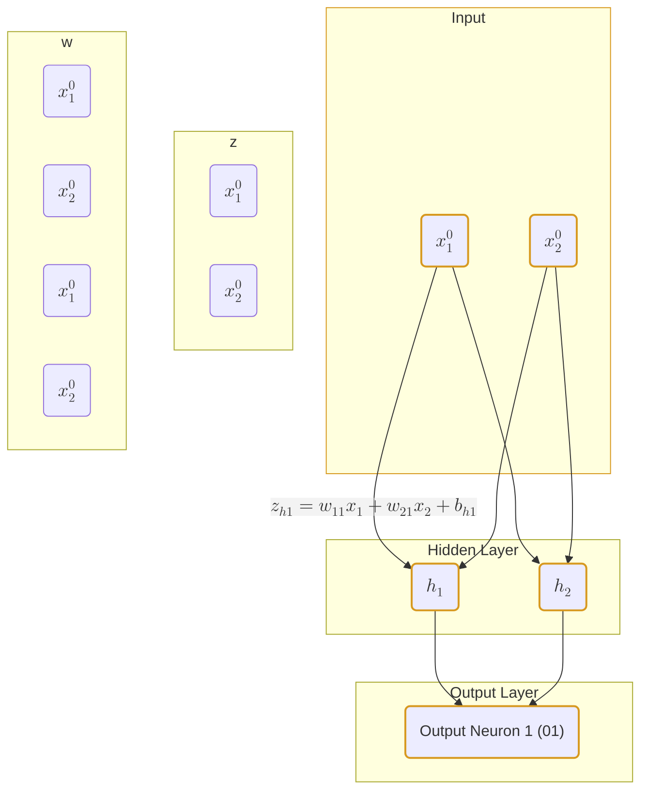
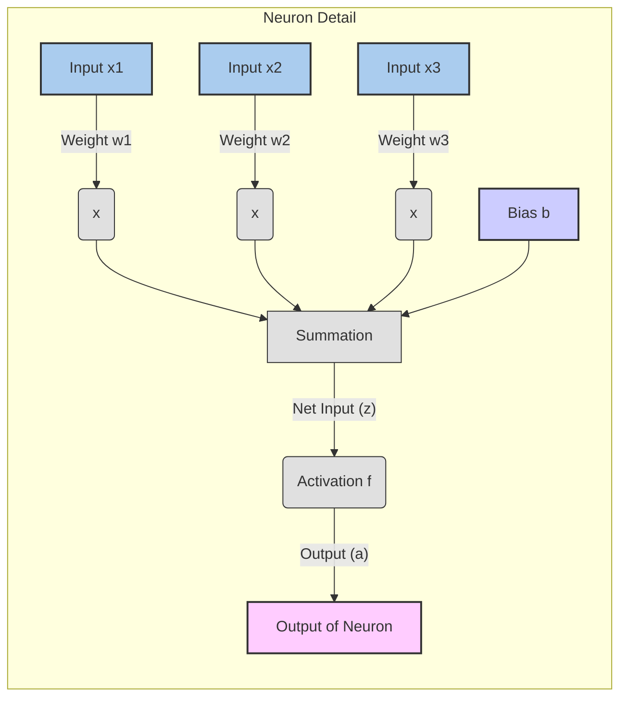

- concatenates several (stacked) perceptrons 
- such that the output of one ’layer’ is the input to the next
## Architecture
- Layers 
	- Input 
	- Hidden
	- Output
- Neuros (Nodes)
	- Individual computational units in each layer
	- perceptrons in this case
- Connections (Edges)
	- Links between neurons
	- each has a weight
- Bias
	- **constant value** added to weighted sum of inputs for each neuron
- Activation Function
	- A **non-linear function** applied to the weighted sum of inputs in a neuron
	- **Sigmoid** in our case
		-  $\sigma(z) = \frac{1}{1 + e^{-z}}$ 
		- Derivative: $\sigma'(z) = \sigma(z)(1 - \sigma(z))$
## Loss Function
- Measures the discrepancy between the networks predicted output $\hat{y}$ and the actual target output $y$
### mean squared error
- $L = \frac{1}{2} \sum (y - \hat{y})^2$
- Often simplified to $\frac{1}{2}(y - \hat{y})^2$ for a single output neuron
### [[Cross-Entropy Loss]]:
- $V_{ec}(x,y,f) = -log p(y|x)$
- 
## [[Gradient Descent]]

## Chain Rule of Calculus
* The mathematical foundation of backpropagation. It allows us to compute the derivative of a composite function.
* If $f(x) = g(h(x))$, then $\frac{df}{dx} = \frac{dg}{dh} \cdot \frac{dh}{dx}$. 
* Backpropagation applies this iteratively from the output layer backward to calculate the gradient for each parameter.

## Steps for Backpropagation by hand
### 1. Initialization:
- all weights and biases get random values
	- crucial for breaking symmetry, so neurons can learn different features
- choose learning rate $\eta$
### 2. Forward Pass
- For a given input point calculate the output of each neuron in the network
	- layer by layer, from input to output
- For each neuron
	- Calculate the **net input**
		- weighted sum of inputs plus bias
$$z=\sum(w_i*x_i)+b$$
	- Apply the **activation function** to net input to get **output**
$$a=f(z)$$
- **Calculate** the total error (**loss**) at the output layer using loss function
#### Example
* Input layer with 2 inputs ($x_1, x_2$)
* Hidden layer with 2 neurons ($h_1, h_2$)
* Output layer with 1 neuron ($o_1$)
**Input to Hidden Layer:**
* Net input to $h_1$: $z_{h1} = w_{11}x_1 + w_{21}x_2 + b_{h1}$
* Output of $h_1$: $a_{h1} = \sigma(z_{h1})$
* Net input to $h_2$: $z_{h2} = w_{12}x_1 + w_{22}x_2 + b_{h2}$
* Output of $h_2$: $a_{h2} = \sigma(z_{h2})$

**Hidden to Output Layer:**
* Net input to $o_1$: $z_{o1} = w_{h1o1}a_{h1} + w_{h2o1}a_{h2} + b_{o1}$
* Output of $o_1$: $\hat{y} = a_{o1} = \sigma(z_{o1})$

**Loss Calculation (MSE):**
* $L = \frac{1}{2}(y - \hat{y})^2$ (where $y$ is the target output)

### 3. Backwards Pass
- start from output and move backward
- calculating error contribution of each weight and bias
- applling chain rule
#### Output Layer Gradients
- **Error Function**
$$
E = \left\{ 
			\begin{aligned}			
				-\log(x^{(2)}),     & \text{ if } y=1, \\
				-\log(1 - x^{(2)}), & \text{ if } y=0
			\end{aligned}
		\right.
$$

* if $y=1$, we have that$$\frac{\partial E}{\partial x^{(2)}} = \frac{-1}{x^{(2)}}$$
		([[Rules for Derivatives#Logarithmic Functions]])
* if $y=0$, we have that
$$\frac{\partial E}{\partial x^{(2)}} = \frac{1}{1 - x^{(2)}}$$
* **Error with respect to the output:**
$$
\frac{\partial E}{\partial x^{(2)}} = 
  -\frac{y}{x^{(2)}} +
  \frac{1 - y}{1 - x^{(2)}}
$$

#### $L$th Layer Gradients 
*second layer in this case*
we can backpropagate the error from $x^{(2)}$ to $s^{(2)}$ by computing the derivative 
  $$\frac{\partial E}{\partial s^{(2)}} = \frac{\partial E}{\partial x^{(2)}} \odot \frac{\partial x^{(2)}}{\partial s^{(2)}}$$
Given that $x^{(2)} = \sigma(s^{(2)})$, with and $\sigma'(x) = \sigma(x) \cdot (1 - \sigma(x))$ we have that 
  $$\frac{\partial x^{(2)}}{\partial s^{(2)}} = \sigma(s^{(2)}) \odot (1 - \sigma(s^{(2)}))$$
  
  and thus

$$
\frac{\partial E}{\partial s^{(2)}} = 
  \frac{\partial E}{\partial x^{(2)}} \odot 
  x^{(2)} \odot (1 - x^{(2)})
$$

where $\odot$ is the element-wise multiplication, which means that
  $$\frac{\partial E}{\partial s^{(2)}} = 
  \left( \frac{\partial E}{\partial s_j^{(2)}} \right)_{j=1,\ldots,M}  \in \mathbb R^M$$
  and

$$
\frac{\partial E}{\partial s_j^{(2)}} = 
  \frac{\partial E}{\partial x_j^{(2)}} \cdot 
  x_j^{(2)} \cdot (1 - x_j^{(2)})
$$
### 4. Weight and Bias Updates
Once you have all the gradients ($\frac{\partial L}{\partial w}$ and $\frac{\partial L}{\partial b}$), update the weights and biases using the gradient descent rule:

* $w_{new} = w_{old} - \eta \cdot \frac{\partial L}{\partial w_{old}}$
* $b_{new} = b_{old} - \eta \cdot \frac{\partial L}{\partial b_{old}}$

### 5. Repeat
- Repeat steps 2-4 for multiple training examples (or batches of examples in mini-batch gradient descent)
- and multiple **epochs** (full passes through the entire training dataset) 
- until the loss converges or reaches an acceptable level.

seem also: [[MLPs]]